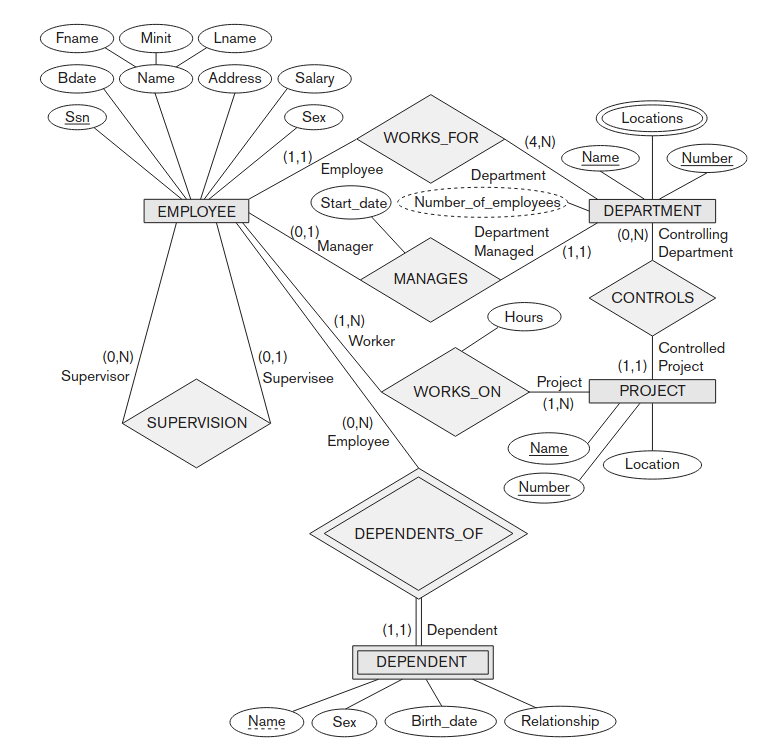

A transformação automatizada de Diagramas Entidade-Relacionamento (ER) em Esquemas Lógicos Relacionais tem evoluído substancialmente com a adoção de Modelos de Visão e Linguagem (VLMs). Com base no estudo referencial de *Silva et al. (2026)*, conduzi uma avaliação estendida para determinar a viabilidade técnica e financeira da substituição de modelos de inteligência artificial proprietários (como GPT, Gemini e Claude) por modelos de fronteira de código aberto (*open-weights*), como Qwen-3, Llama 3.2 e Mistral.

**Metodologia e o Limite Sintático**

O benchmark utilizou o diagrama clássico "Company Schema" (Elmasri & Navathe) como padrão-ouro para a extração arquitetural. A metodologia consistiu em submeter as imagens aos modelos utilizando duas abordagens de *prompting*: o **Prompt 1 (Instrução Direta)**, solicitando a estrutura sem exemplos prévios, e o **Prompt 2 (Raciocínio Guiado)**, que providenciava regras de mapeamento de cardinalidade (1:N, N:M). Os modelos foram configurados com amostragem determinística (`temperature=0`) e orientados a extrair entidades, chaves primárias e chaves estrangeiras em formato JSON.

Na correção das saídas JSON, adotei uma dupla estratégia de auditoria: um analisador sintático rigoroso (exigindo correspondência exata de *strings*) e um avaliador semântico (tolerando renomeações naturais baseadas em expressões regulares).

Observei que, sob uma avaliação de correspondência de texto estrita (sintática), a maioria das arquiteturas estagnou na faixa de 70% de F1-Score. Esse "teto de vidro" ocorre porque representações visuais omitem frequentemente prefixos textuais (ex: exibir a string `Name` no lugar da coluna `Dname`), levando o analisador a penalizar modelos que não possuem esse contexto implícito sem intervenção.

**Desempenho Semântico e Modelos Abertos**

Ao aplicar um avaliador semântico tolerante a variações literais inofensivas, o desempenho aumentou em média 20 pontos percentuais. A tabela abaixo apresenta os resultados consolidados de precisão sintática e semântica entre os principais modelos sob as metodologias de Prompt Direto (1) e Raciocínio Guiado (2):

| Modelo e Contexto | Custo 1M Tokens (In / Out) | F1-Score (Sintático) | Acurácia (Sintática) | F1-Score (Semântico) | Acurácia (Semântica) |
|:---|:---:|:---:|:---:|:---:|:---:|
| **Modelos Fechados (Top 3)** | | | | | |
| Claude Opus 4.8 (Prompt 1) | $5.00 / $25.00 | 97.06% | 94.29% | 97.83% | 97.83% |
| Gemini 3.5 Flash (Prompt 1) | $1.50 / $9.00 | 73.53% | 58.14% | 95.65% | 95.65% |
| GPT-5.5 (Prompt 1) | $5.00 / $30.00 | 67.65% | 51.11% | 93.48% | 93.48% |
| **Modelos Abertos (Top 3)** | | | | | |
| **Qwen-3 VL 235B (Prompt 2)** | **$0.20 / $0.88** | 69.57% | 53.33% | **92.47%** | **91.49%** |
| Mistral Large (Prompt 2) | $0.50 / $1.50 | 64.79% | 47.92% | 80.00% | 77.55% |
| Llama 3.2 11B Vision (Prompt 2) | $0.345 / $0.345 | 32.35% | 19.30% | 45.45% | 47.62% |

Neste cenário, a arquitetura aberta **Qwen-3 VL 235B** (destaque na tabela) alcançou precisão comparável aos líderes proprietários, porém a uma fração do custo ($0.20 por milhão de tokens de entrada em contraste com $5.00 a $15.00 da OpenAI/Anthropic).

**O Efeito de Saturação de Contexto**

Minha pesquisa avaliou a resposta das redes à injeção de regras explícitas (Prompt 2 - regras de mapeamento 1:N, N:M). Como evidenciado nos resultados gerais, onde modelos de grande escala como o Claude 4.8 tiveram recuo de performance sob o Prompt 2, observa-se uma degradação na abstração natural. Esse fenômeno sugere que essas arquiteturas já possuem as abstrações profundamente codificadas em seus pesos; assim, a injeção forçada de regras dilui a atenção da rede e degrada as inferências corretas.

**Conclusões Técnicas**

A avaliação empírica confirma que as arquiteturas de *open-weights* contemporâneas compreendem a fundo os diagramas relacionais. Para implantações escaláveis em engenharia de dados, o uso de modelos abertos como o Qwen-3 VL é financeiramente superior, desde que arquitetado em conjunto com algoritmos determinísticos locais de validação sintática.

The automated transformation of Entity-Relationship (ER) Diagrams into Relational Logical Schemas has evolved substantially with the adoption of Vision-Language Models (VLMs). Building upon the referential study by *Silva et al. (2026)*, I conducted an extended evaluation to determine the technical and financial viability of replacing proprietary artificial intelligence models (such as GPT, Gemini, and Claude) with frontier open-weights models, such as Qwen-3, Llama 3.2, and Mistral.

**Methodology and the Syntactic Limit**

The benchmark utilized the classic "Company Schema" (Elmasri & Navathe) as the gold standard for architectural extraction. The methodology consisted of submitting the images to the models using two prompting approaches: **Prompt 1 (Direct Instruction)**, requesting the structure without prior examples, and **Prompt 2 (Guided Reasoning)**, which provided cardinality mapping rules (1:N, N:M). The models were configured with deterministic sampling (`temperature=0`) and instructed to extract entities, primary keys, and foreign keys in JSON format.

When correcting the JSON outputs, I adopted a dual audit strategy: a strict syntactic analyzer (requiring exact string matching) and a semantic evaluator (tolerating natural renames based on regular expressions).

I observed that, under strict text matching evaluation (syntactic), the majority of architectures plateaued around a 70% F1-Score. This "glass ceiling" occurs because visual representations frequently omit textual prefixes (e.g., displaying the string `Name` instead of the column `Dname`), leading the parser to penalize models lacking this implicit context without intervention.

**Semantic Performance and Open Models**

When applying a semantic evaluator tolerant of harmless literal variations, performance increased by an average of 20 percentage points. The table below presents the consolidated results of syntactic and semantic accuracy among the main models under Direct Prompt (1) and Guided Reasoning (2) methodologies:

| Model and Context | Cost per 1M Tokens (In/Out) | Syntactic F1-Score | Syntactic Accuracy | Semantic F1-Score | Semantic Accuracy |
|:---|:---:|:---:|:---:|:---:|:---:|
| **Proprietary Models (Top 3)** | | | | | |
| Claude Opus 4.8 (Prompt 1) | $5.00 / $25.00 | 97.06% | 94.29% | 97.83% | 97.83% |
| Gemini 3.5 Flash (Prompt 1) | $1.50 / $9.00 | 73.53% | 58.14% | 95.65% | 95.65% |
| GPT-5.5 (Prompt 1) | $5.00 / $30.00 | 67.65% | 51.11% | 93.48% | 93.48% |
| **Open-Weights Models (Top 3)**| | | | | |
| **Qwen-3 VL 235B (Prompt 2)** | **$0.20 / $0.88** | 69.57% | 53.33% | **92.47%** | **91.49%** |
| Mistral Large (Prompt 2) | $0.50 / $1.50 | 64.79% | 47.92% | 80.00% | 77.55% |
| Llama 3.2 11B Vision (Prompt 2) | $0.345 / $0.345 | 32.35% | 19.30% | 45.45% | 47.62% |

In this scenario, the open architecture **Qwen-3 VL 235B** (highlighted in the table) achieved accuracy comparable to proprietary leaders, but at a fraction of the cost ($0.20 per million input tokens contrasted with $5.00 to $15.00 from OpenAI/Anthropic).

**The Context Saturation Effect**

My research evaluated network responses to the injection of explicit rules (Prompt 2 - 1:N, N:M mapping rules). As evidenced by the results of Claude 4.8, whose performance receded when subjected to Prompt 2, a degradation in performance is observed in large-scale models. This phenomenon suggests that these abstractions are already deeply encoded within their weights; thus, the forced injection of rules dilutes the network's attention and degrades correct inferences.

**Technical Conclusions**

Empirical evaluation confirms that contemporary open-weights architectures deeply understand relational diagrams. For scalable data engineering deployments, leveraging open models like Qwen-3 VL is financially superior, provided they are architected in tandem with deterministic local syntactic validation algorithms.

La transformación automatizada de diagramas Entidad-Relación (ER) a esquemas lógicos relacionales ha evolucionado sustancialmente con la adopción de modelos de visión y lenguaje (VLM). Partiendo del estudio de referencia de *Silva et al. (2026)*, realicé una evaluación extendida para determinar la viabilidad técnica y financiera de sustituir modelos propietarios de inteligencia artificial (como GPT, Gemini y Claude) por modelos de vanguardia de código abierto (*open-weights*), tales como Qwen-3, Llama 3.2 y Mistral.

**Metodología y el Límite Sintáctico**

El banco de pruebas utilizó el clásico "Company Schema" (Elmasri & Navathe) como estándar de oro para la extracción arquitectónica. La metodología consistió en someter las imágenes a los modelos utilizando dos enfoques de *prompting*: el **Prompt 1 (Instrucción Directa)**, solicitando la estructura sin ejemplos previos, y el **Prompt 2 (Razonamiento Guiado)**, que proporcionaba reglas de mapeo de cardinalidad (1:N, N:M). Los modelos se configuraron con muestreo determinista (`temperature=0`) y se les instruyó para extraer entidades, claves primarias y claves foráneas en formato JSON.

Al corregir las salidas JSON, adopté una estrategia de auditoría dual: un analizador sintáctico estricto (que exigía una coincidencia exacta de cadenas) y un evaluador semántico (que toleraba renombres naturales basados en expresiones regulares).

Observé que, bajo una evaluación de correspondencia de texto estricta (sintáctica), la mayoría de las arquitecturas se estancaron alrededor de un F1-Score del 70%. Este "techo de cristal" se produce porque las representaciones visuales omiten frecuentemente prefijos textuales (por ejemplo, mostrando la cadena `Name` en lugar de la columna `Dname`), lo que lleva al analizador a penalizar a los modelos que carecen de este contexto implícito sin intervención.

**Rendimiento Semántico y Modelos Abiertos**

Al aplicar un evaluador semántico tolerante a variaciones literales inofensivas, el rendimiento aumentó en un promedio de 20 puntos porcentuales. La siguiente tabla presenta los resultados consolidados de precisión sintáctica y semántica entre los modelos principales bajo las metodologías de Prompt Directo (1) y Razonamiento Guiado (2):

| Modelo y Contexto | Costo 1M Tokens (In / Out) | F1-Score (Sintáctico) | Precisión (Sintáctica) | F1-Score (Semántico) | Precisión (Semántica) |
|:---|:---:|:---:|:---:|:---:|:---:|
| **Modelos Propietarios (Top 3)**| | | | | |
| Claude Opus 4.8 (Prompt 1) | $5.00 / $25.00 | 97.06% | 94.29% | 97.83% | 97.83% |
| Gemini 3.5 Flash (Prompt 1) | $1.50 / $9.00 | 73.53% | 58.14% | 95.65% | 95.65% |
| GPT-5.5 (Prompt 1) | $5.00 / $30.00 | 67.65% | 51.11% | 93.48% | 93.48% |
| **Modelos Abiertos (Top 3)** | | | | | |
| **Qwen-3 VL 235B (Prompt 2)** | **$0.20 / $0.88** | 69.57% | 53.33% | **92.47%** | **91.49%** |
| Mistral Large (Prompt 2) | $0.50 / $1.50 | 64.79% | 47.92% | 80.00% | 77.55% |
| Llama 3.2 11B Vision (Prompt 2) | $0.345 / $0.345 | 32.35% | 19.30% | 45.45% | 47.62% |

En este escenario, la arquitectura abierta **Qwen-3 VL 235B** (destacada en la tabla) alcanzó una precisión comparable a la de líderes propietarios, pero a una fracción del costo ($0.20 por millón de tokens de entrada en contraste con $5.00 a $15.00 de OpenAI/Anthropic).

**El Efecto de Saturación de Contexto**

Mi investigación evaluó la respuesta de las redes a la inyección de reglas explícitas (Prompt 2 - reglas de mapeo 1:N, N:M). Como lo demuestran los resultados de Claude 4.8, cuyo rendimiento retrocedió al someterse al Prompt 2, se observa una degradación del rendimiento en modelos de gran escala. Este fenómeno sugiere que estas abstracciones ya están codificadas profundamente en sus pesos; por lo tanto, la inyección forzada de reglas diluye la atención de la red y degrada las inferencias correctas.

**Conclusiones Técnicas**

La evaluación empírica confirma que las arquitecturas contemporáneas de pesos abiertos comprenden a fondo los diagramas relacionales. Para implementaciones escalables en ingeniería de datos, el uso de modelos abiertos como Qwen-3 VL es financieramente superior, siempre y cuando se diseñen junto con algoritmos deterministas locales de validación sintáctica.

La transformation automatisée de diagrammes Entité-Relation (ER) en schémas logiques relationnels a considérablement évolué avec l'adoption des modèles de vision et de langage (VLM). En nous appuyant sur l'étude de référence de *Silva et al. (2026)*, j'ai mené une évaluation approfondie pour déterminer la viabilité technique et financière du remplacement de modèles d'intelligence artificielle propriétaires (tels que GPT, Gemini et Claude) par des modèles de pointe open-source (*open-weights*), tels que Qwen-3, Llama 3.2 et Mistral.

**Méthodologie et Limite Syntaxique**

Le banc d'essai a utilisé le classique "Company Schema" (Elmasri & Navathe) comme référence absolue pour l'extraction architecturale. La méthodologie a consisté à soumettre les images aux modèles en utilisant deux approches de *prompting* : le **Prompt 1 (Instruction Directe)**, demandant la structure sans exemples préalables, et le **Prompt 2 (Raisonnement Guidé)**, qui fournissait des règles de mappage de cardinalité (1:N, N:M). Les modèles ont été configurés avec un échantillonnage déterministe (`temperature=0`) et ont été chargés d'extraire des entités, des clés primaires et des clés étrangères au format JSON.

Lors de la correction des sorties JSON, j'ai adopté une double stratégie d'audit : un analyseur syntaxique strict (exigeant une correspondance exacte des chaînes) et un évaluateur sémantique (tolérant les renommages naturels basés sur des expressions régulières).

J'ai observé que, sous une évaluation stricte de la correspondance de texte (syntaxique), la plupart des architectures stagnaient autour d'un F1-Score de 70 %. Ce "plafond de verre" se produit parce que les représentations visuelles omettent fréquemment les préfixes textuels (ex. : afficher la chaîne `Name` au lieu de la colonne `Dname`), ce qui conduit l'analyseur à pénaliser les modèles dépourvus de ce contexte implicite sans intervention.

**Performances Sémantiques et Modèles Ouverts**

L'application d'un évaluateur sémantique tolérant aux variations littérales inoffensives a permis d'augmenter les performances de 20 points de pourcentage en moyenne. Le tableau ci-dessous présente les résultats consolidés de précision syntaxique et sémantique parmi les principaux modèles selon les méthodologies de Prompt Direct (1) et de Raisonnement Guidé (2) :

| Modèle et Contexte | Coût 1M Tokens (In / Out) | F1-Score (Syntaxique) | Précision (Syntaxique) | F1-Score (Sémantique) | Précision (Sémantique) |
|:---|:---:|:---:|:---:|:---:|:---:|
| **Modèles Propriétaires (Top 3)**| | | | | |
| Claude Opus 4.8 (Prompt 1) | $5.00 / $25.00 | 97.06% | 94.29% | 97.83% | 97.83% |
| Gemini 3.5 Flash (Prompt 1) | $1.50 / $9.00 | 73.53% | 58.14% | 95.65% | 95.65% |
| GPT-5.5 (Prompt 1) | $5.00 / $30.00 | 67.65% | 51.11% | 93.48% | 93.48% |
| **Modèles Ouverts (Top 3)** | | | | | |
| **Qwen-3 VL 235B (Prompt 2)** | **$0.20 / $0.88** | 69.57% | 53.33% | **92.47%** | **91.49%** |
| Mistral Large (Prompt 2) | $0.50 / $1.50 | 64.79% | 47.92% | 80.00% | 77.55% |
| Llama 3.2 11B Vision (Prompt 2) | $0.345 / $0.345 | 32.35% | 19.30% | 45.45% | 47.62% |

Dans ce scénario, l'architecture ouverte **Qwen-3 VL 235B** (mise en évidence dans le tableau) a atteint une précision comparable à celle des leaders propriétaires, mais à une fraction du coût (0,20 $ par million de tokens en entrée par rapport à 5,00 $ ou 15,00 $ pour OpenAI/Anthropic).

**L'Effet de Saturation de Contexte**

Ma recherche a évalué les réponses des réseaux à l'injection de règles explicites (Prompt 2 - règles de mappage 1:N, N:M). Comme en témoignent les résultats de Claude 4.8, dont les performances ont reculé lorsqu'il a été soumis au Prompt 2, on observe une dégradation des performances dans les modèles à grande échelle. Ce phénomène suggère que ces abstractions sont déjà profondément encodées dans leurs poids ; ainsi, l'injection forcée de règles dilue l'attention du réseau et dégrade les inférences correctes.

**Conclusions Techniques**

L'évaluation empirique confirme que les architectures contemporaines *open-weights* comprennent en profondeur les diagrammes relationnels. Pour les déploiements évolutifs en ingénierie des données, l'utilisation de modèles ouverts comme le Qwen-3 VL est financièrement supérieure, à condition qu'ils soient conçus conjointement avec des algorithmes locaux déterministes de validation syntaxique.

この記事を読むには、Chromeの翻訳機能を使用してください。

请使用Chrome浏览器翻译功能阅读本文。

Bitte verwenden Sie den Chrome-Übersetzer, um diesen Artikel zu lesen.

Пожалуйста, используйте переводчик Chrome, чтобы прочитать эту статью.

